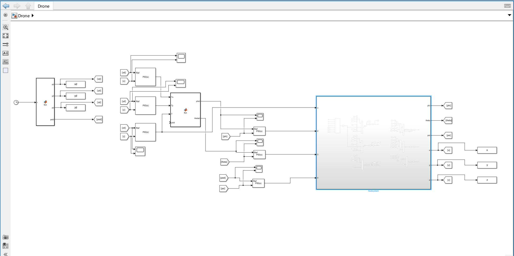
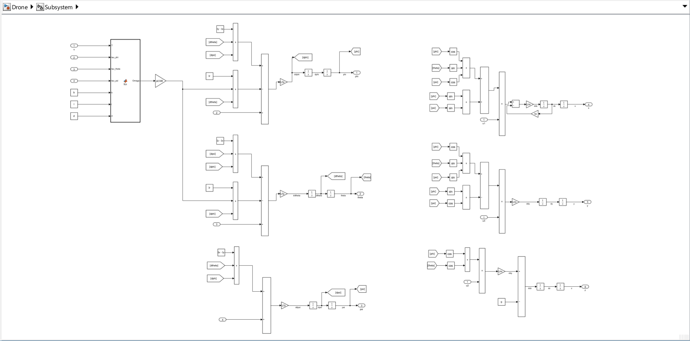
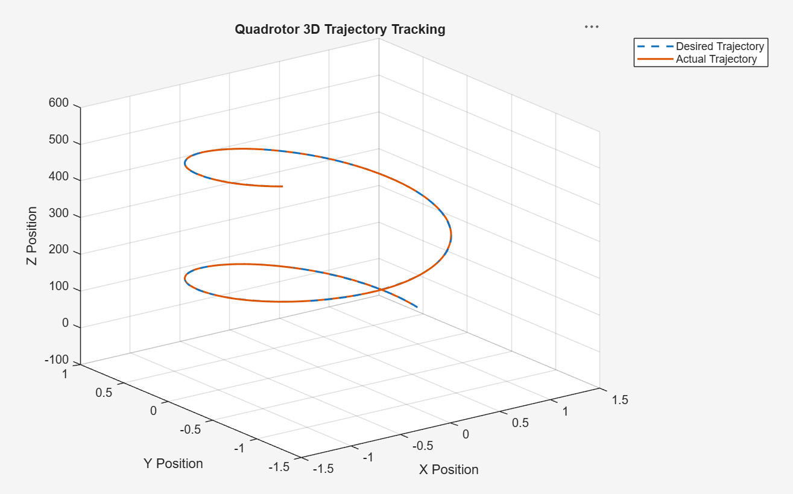
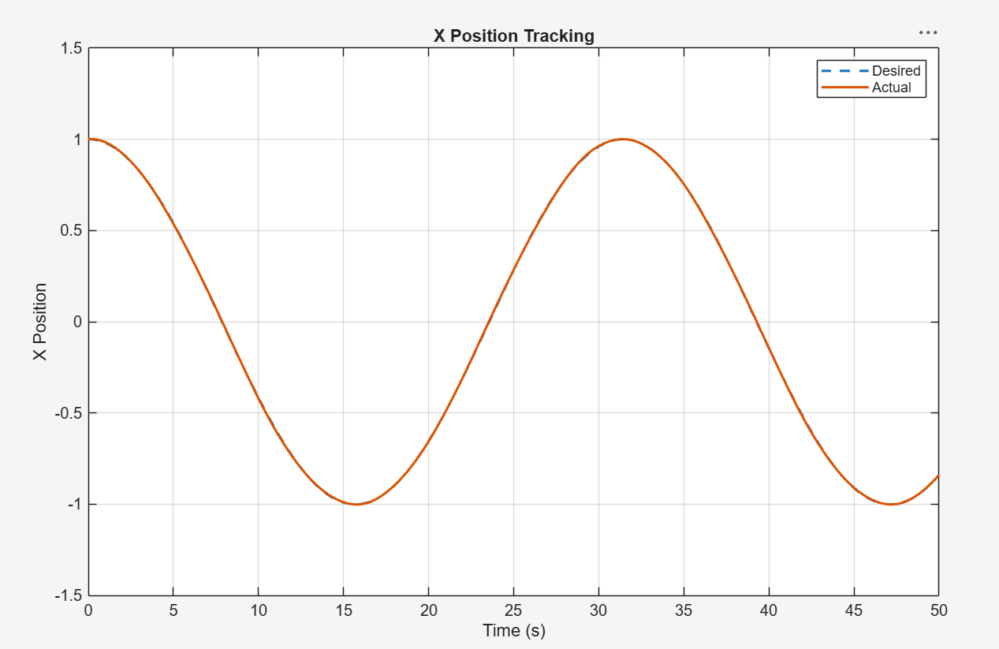
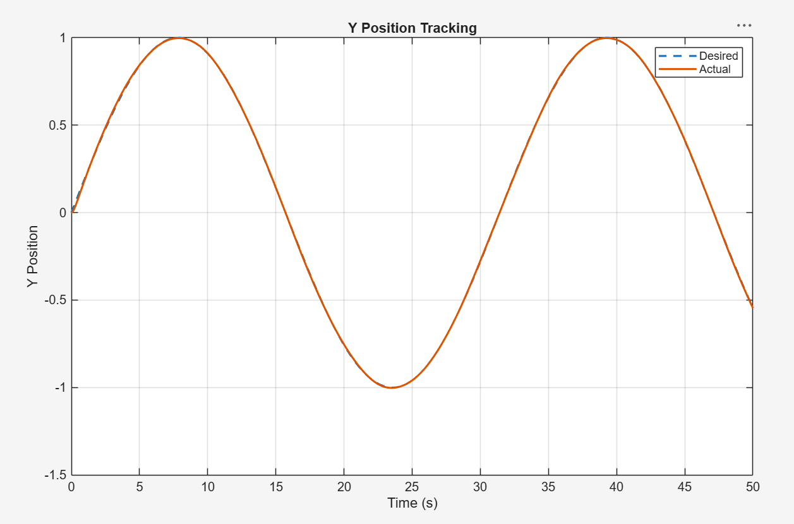
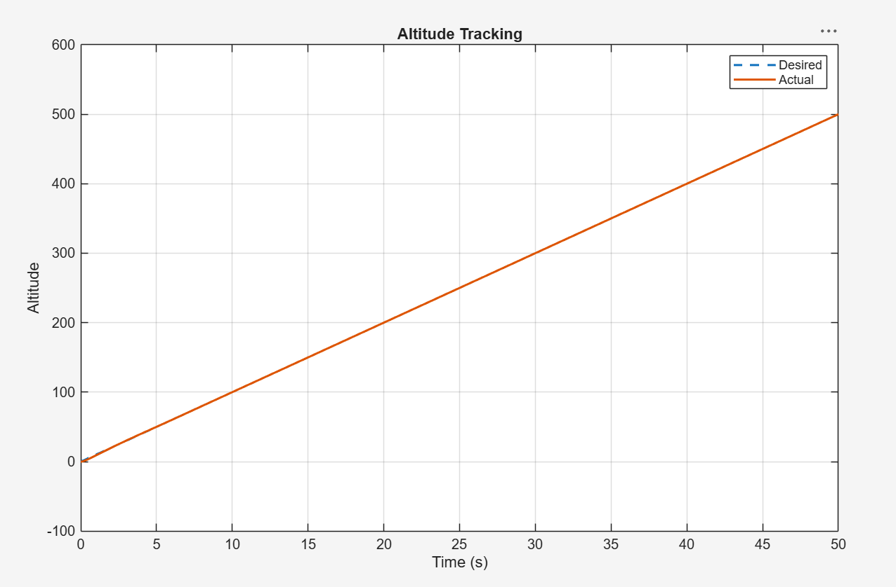
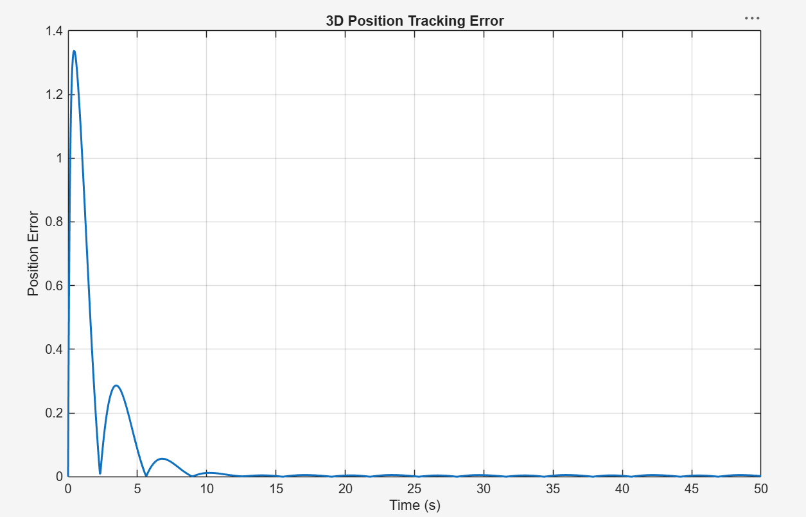

# Quadrotor Dynamics & PID Flight Control

A 12-state nonlinear quadrotor dynamics and cascaded PID flight-control simulation developed in MATLAB/Simulink. The project models the translational and rotational motion of a quadrotor and implements closed-loop position and attitude control for 3D trajectory tracking.

## Overview

The objective of this project was to develop a complete quadrotor simulation from its underlying dynamics and implement a control system capable of following a commanded three-dimensional trajectory.

The model incorporates:

- Nonlinear translational and rotational quadrotor dynamics
- X, Y, and Z position control
- Roll, pitch, and yaw attitude control
- Cascaded PID control loops
- Desired attitude command generation
- Rotor and gyroscopic effects
- Rotation-matrix calculations
- Symbolic rotational-dynamics derivation
- 3D trajectory generation and tracking

## Tools

- MATLAB
- Simulink
- Symbolic Math Toolbox
- PID Controllers
- MATLAB Function Blocks

## System Architecture

The flight-control architecture uses cascaded position and attitude control loops.

The outer position controllers compare the desired and actual X, Y, and Z positions. Their outputs are used to generate thrust and desired attitude commands. Inner PID controllers then regulate the quadrotor's roll, pitch, and yaw angles before the commands are applied to the nonlinear quadrotor dynamics model.



## Quadrotor Dynamics Model

The Simulink plant models both rotational and translational motion.

The rotational states consist of:

- Roll (`phi`)
- Pitch (`theta`)
- Yaw (`psi`)
- Roll rate
- Pitch rate
- Yaw rate

The translational states consist of:

- X position and velocity
- Y position and velocity
- Z position and velocity

Together, these form the 12-state dynamic representation of the quadrotor.



## Reference Trajectory

A MATLAB Function block generates the desired position and yaw references as functions of simulation time.

```matlab
xd = cos(0.2*t);
yd = sin(0.2*t);
zd = 10*t;
psid = sin(t);
```

The X and Y reference signals generate circular motion while the increasing Z reference creates a three-dimensional helical trajectory.

## Attitude Command Generation

The position controller outputs are converted into desired roll and pitch angles using the commanded translational forces, total thrust, and desired yaw angle.

```matlab
phid = (Tx*sin(psid) - Ty*cos(psid))/T;
thetad = ((Tx*cos(psid) + Ty*sin(psid))/cos(phid))/T;

phid = max(phid, -pi/6);
phid = min(phid, pi/6);

thetad = max(thetad, -pi/6);
thetad = min(thetad, pi/6);
```

The desired roll and pitch angles are limited to ±30 degrees to constrain the commanded attitude.

## Rotational Dynamics

The rotational subsystem incorporates quadrotor moments of inertia and angular coupling between the roll, pitch, and yaw axes.

Rotor-speed effects are calculated using a MATLAB Function block based on total thrust and attitude-control torques.

The symbolic rotational coupling term is evaluated as:

```matlab
omega = [dphi; dtheta; dpsi];

I = [Ix, 0,  0;
     0,  Iy, 0;
     0,  0,  Iz];

result = cross(omega, I*omega);
```

This represents the nonlinear term:

`omega × (I * omega)`

used in the rotational equations of motion.

## Rotation Matrix

The transformation between the quadrotor body frame and inertial frame is constructed using roll, pitch, and yaw rotation matrices.

```matlab
R = Rz * Ry * Rx;
```

This rotation matrix is used to relate forces generated in the quadrotor body frame to motion in the inertial coordinate system.

## Simulation Results

### 3D Trajectory Tracking

The desired trajectory is compared with the simulated quadrotor position in three dimensions.



### X-Position Tracking

The X-position controller tracks the sinusoidal X reference generated by the trajectory function.



### Y-Position Tracking

The Y-position controller tracks the corresponding sinusoidal Y reference.



### Altitude Tracking

The altitude controller regulates the vertical position of the quadrotor as the commanded altitude increases with time.



### Position Tracking Error

The position-tracking error provides a quantitative indication of the difference between the commanded and simulated quadrotor trajectories.



## Model Parameters

Physical parameters are defined in `Drone_parameters.m`, including:

| Parameter | Description |
|---|---|
| `Ix` | Moment of inertia about X axis |
| `Iy` | Moment of inertia about Y axis |
| `Iz` | Moment of inertia about Z axis |
| `Ir` | Rotor rotational inertia |
| `b` | Thrust coefficient |
| `d` | Drag coefficient |
| `l` | Distance from rotor to quadrotor center |
| `m` | Quadrotor mass |
| `g` | Gravitational acceleration |
| `kx` | Linear damping coefficient along X axis |

## Project Files

| File | Description |
|---|---|
| `Drone.slx` | Complete nonlinear quadrotor Simulink model and PID-control system |
| `Drone_parameters.m` | Physical and simulation parameters |
| `rotation_matrix.m` | Symbolic body-to-inertial rotation-matrix derivation |
| `rotational_dynamics_symbolic.m` | Symbolic rotational coupling calculation |
| `images/` | System diagrams and simulation results |

## How to Run

1. Download or clone this repository.
2. Open MATLAB.
3. Navigate to the project directory.
4. Run the parameter script:

```matlab
Drone_parameters
```

5. Open the Simulink model:

```text
Drone.slx
```

6. Run the simulation.
7. Use the Scope blocks and MATLAB workspace outputs to analyze trajectory and controller performance.

## Engineering Concepts Demonstrated

- Nonlinear dynamic modeling
- 12-state quadrotor modeling
- Newton-Euler dynamics
- Cascaded feedback control
- PID controller implementation
- Position control
- Attitude control
- Rotation matrices
- Coordinate transformations
- Translational and rotational dynamics
- Numerical simulation
- Trajectory generation
- 3D trajectory tracking

## Project Outcome

This project demonstrates the implementation of a complete quadrotor flight-control simulation by translating nonlinear mathematical dynamics into a Simulink model and integrating cascaded PID controllers for position and attitude regulation.

The resulting system provides a platform for analyzing quadrotor dynamics, controller performance, and three-dimensional trajectory tracking.
